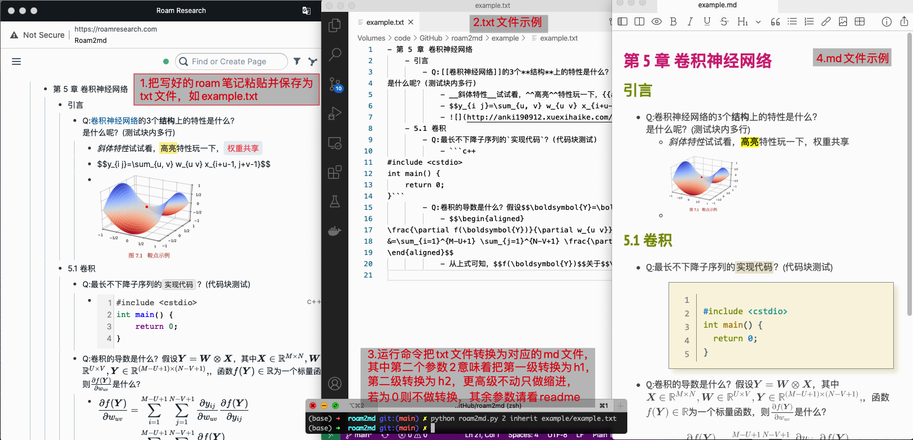

# roam2md
roam2md主要是把Roam Research的笔记转换为显示无误的markdown笔记

# 用法
1. 新建一个txt文件如example.txt，把要转换的roam内容粘贴到文本中
2. 运行python脚本`python roam2md.py 0 example.txt ...`，即可把程序转换为对应的markdown文件 
其中，第一个参数指明了要转换为对应标题样式的级别，支持0~6，0为不转换， 
第二个参数及后续为要转换的文件或文件夹

# 功能列表
* [x] 代码块的处理
* [x] 支持把前几级压扁成对应的h1、h2等的样式，最多支持6级
* [x] 识别行间和行内公式
* [x] 删除双向引用
* [x] 提取alias中名字
* [x] 支持高亮格式从^^转换为==
* [x] 支持斜体从__转换为*

不用转换的功能：
* 删字符
* 加粗
* 图片
* 行内代码
* 超链接

# 测试支持app或网站
* mweb
* csdn

# 依赖
python >= 3.7

# 限制
- 只支持无序列表(Bulleted List)，不支持有序列表(Numbered List)和文档(Document)，原因是有序列表难以判断和解析，支持文档模式会和现有的块内多行的判断有歧义

# 其它说明
- roam2md只支持语法正确时的解析，即保证在roam中能正确解析的，导出后也正确解析，不正确的语法，或故意为难解析器的，，我也没办法哇
- roam2md目前是作者写给自用，用于方便把学习笔记生成markdown格式发布到csdn博客上，若使用过程中发现有解析出来的bug，请提一个issue，（视情况支持，主要不同markdown解析器的小区别太多了）

# 不同版本的区别：区分不同版本发现不同md的解析还有各种小差异和拓展，就区分开来
- vuepress
  - 用于支持在vuepress上写博客的md格式 
  - 不使用第一级#，而从第二级##开始，且增加一个开关支持多种代码的合并
- leetcode
  - 用于支持在leetcode上发题解的md格式
  - 代码块上会加[]，用以多代码合并
- github
  - 用于支持leetcode上的md格式